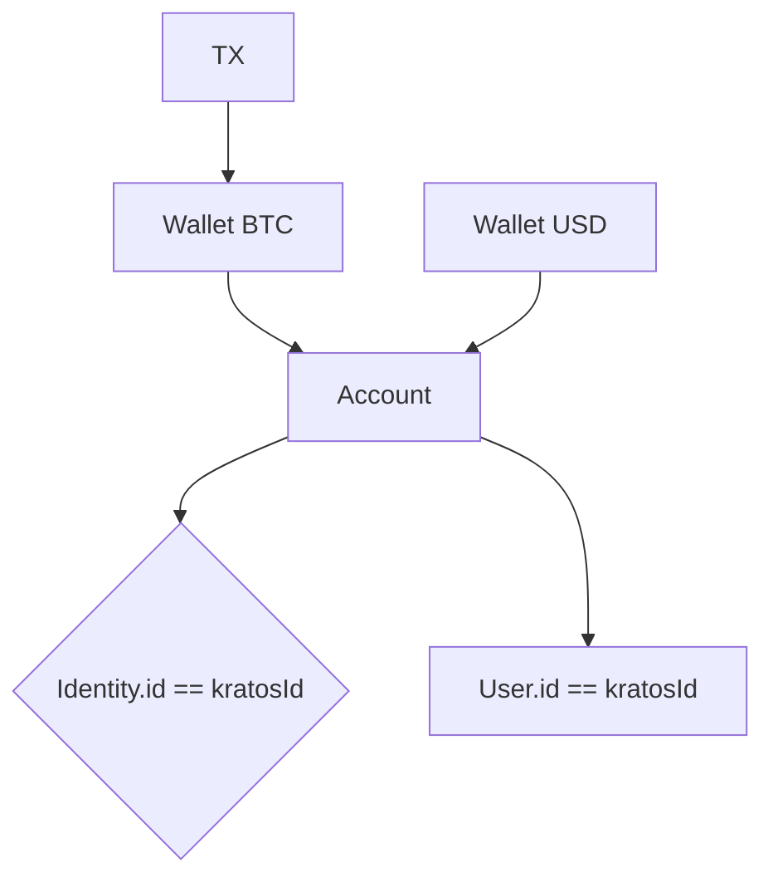

# Galoy Developer Documentation
* This is the source code for the Galoy Developer Documentation website, available at https://dev.galoy.io
* Built using [Docusaurus 2](https://docusaurus.io/), a modern static website generator.
* The deployed version is in the `gh-pages` branch.

## Local development
### Installation
* Requires:
  * git
  * nodejs
  * yarn
* On linux:
  ```
  sudo apt install -y git nodejs yarn
  ```
* download the repo and install the dependencies:
  ```
  git clone https://github.com/GaloyMoney/dev.galoy.io
  cd dev.galoy.io
  yarn
  ```
### Start the local development server
* run in the cd dev.galoy.io directory:
  ```
  yarn start
  ```
  This command starts a local development server and opens up a browser window on http://localhost:3000/ by default. Most changes are reflected live without having to restart the server.

### Build
* run:
  ```
  yarn build
  ```
  This command generates static content into the `build` directory and can be served using any static contents hosting service.

## Deploy changes
* When done editing the docs open a pull request.
* The GitHub Action configured to run when the PR is opened will make a test deployment and check for errors.
* Once the PR is merged the changes will be automatically deployed to the `gh-pages` branch and will become available at https://dev.galoy.io

As a repo admin you can also deploy manually:
* using SSH:
  ```
  USE_SSH=true yarn deploy
  ```

* not using SSH:
  ```
  GIT_USER=<Your GitHub username> yarn deploy
  ```
  If you are using GitHub pages for hosting, this command is a convenient way to build the website and push to the `gh-pages` branch.

---
Account, User, Wallets, and Transaction Relationship Flow
---



