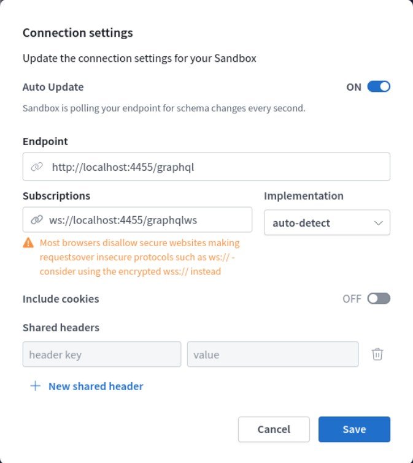

# Backend Servers

## Run locally

Find how to run the backend servers locally in the [project readme](https://github.com/GaloyMoney/galoy#local-development-setup)

## How to expose the API including websocket subscriptions

1. Run:
    ```
    buck2 run //dev:up
    ```
1. Wait for api server to finish coming up, visible via the Tild dashboard at http://localhost:10350/
1. Go to https://studio.apollographql.com/sandbox/explorer?overlay=connection-settings
1. Input the following strings for Endpoint and Subscriptions
    * Endpoint: http://localhost:4455/graphql
    * Subscriptions: ws://localhost:44455/graphql
  

For a fork, you can still use that same apollo studio link and configure the regular graphql endpoint and subscriptions endpoint separately.

## How to run integration tests with Galoy as a dependency

Take a look at the [Quickstart](https://github.com/GaloyMoney/galoy/tree/main/quickstart) if you want to take it for a spin.

## Known issues

*   **Test suite timeouts**: increase jest timeout value. Example:

    ```
    # 120 seconds
    $ JEST_TIMEOUT=120000 yarn test:integration
    ```
* **Integration tests running slow**: we use docker to run dependencies (redis, mongodb, bitcoind and 4 lnds) so the entire test suite is disk-intensive.
  * Please make sure that you are running docker containers in a solid state drive (SSD)
  *   Reduce lnd log disk usage: change debuglevel to critical

      ```
      # ./dev/lnd/lnd.conf
      debuglevel=critical
      ```


## Running checks

It's recommended that you use plugins in your editor to run ESLint checks and perform Prettier formatting on-save.

If you need to run Prettier through the command line, you can use:

```
$ yarn prettier -w .
```
