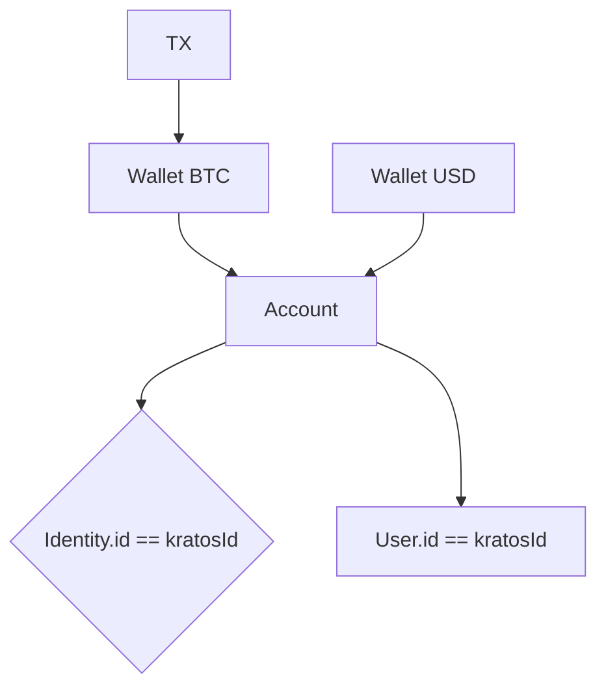

### Relations of the user, the account and the wallets on the backend

```mermaid
flowchart TD
    B[Account] --> A0{Identity.id == kratosId}
    B[Account] --> A1[User.id == kratosId]
    C[Wallet BTC] --> B
    D[Wallet USD] --> B
    E[TX] --> C
```
