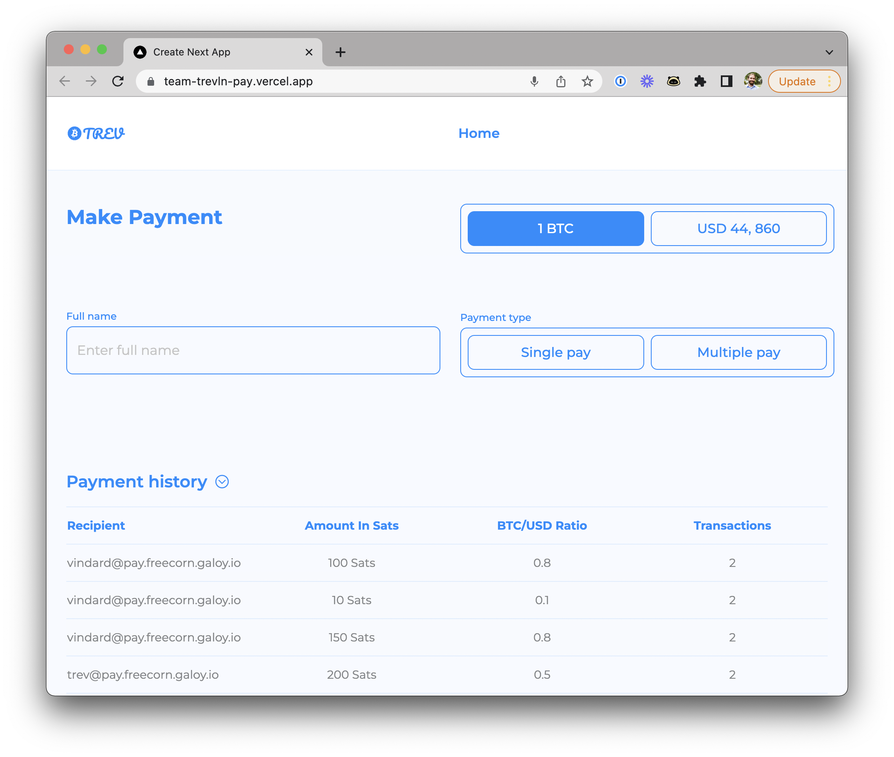

# LN Address payroll tool

### LN Address payroll tool w/USD & sats over Lightning – TeamTREV

TeamTREV built this awesome demo for the [Shock the Web ](https://bolt.fun/hackathons/shock-the-web/)hackathon hosted by [BOLT.fun](https://bolt.fun).

The tool makes use of USD over Lightning feature, which allows users to protect their funds against Bitcoin's volatility by hold synthetic dollars in their Lightning wallet.

View the demo: [https://team-trevln-pay.vercel.app/](https://team-trevln-pay.vercel.app)

View the project Repo on GitHub: [https://github.com/elraphty/TeamTREVLNpay](https://github.com/elraphty/TeamTREVLNpay)

Learn about USD over Lightning: [Nicolas Burtey Shock the Web presentation](https://youtu.be/mXYYCRSEsJU)

